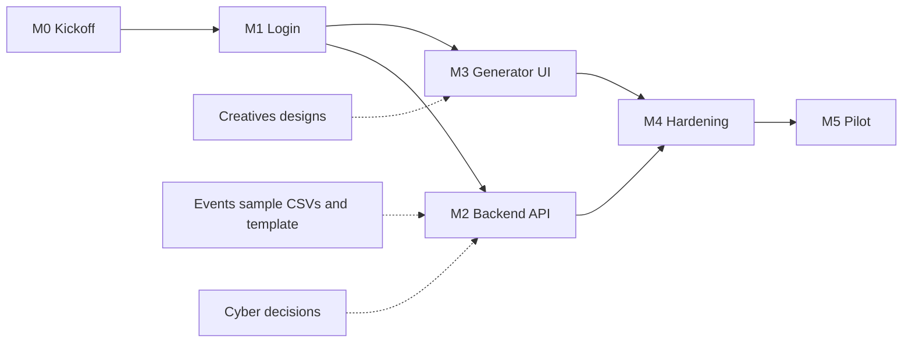

# dBugLabs_OS — Documentation

dBugLabs_OS is the internal operating system of dBug Labs: one web app, behind
one admin password, that holds the tools the club uses to run itself.

The first module is the **Certificate Generator**, ported from the SQAC Portal.
It lets an organiser upload a certificate template and a list of participants,
then issues every participant a certificate with a unique credential ID and a
QR code that anyone can scan to check the certificate is genuine. The
certificates are downloaded as a ZIP and emailed to each participant.

This folder is the single source of truth for what we are building, how it
works, and who builds which part.

---

## Contents

### Spec (what we are building)

| # | Document | Read it if you are… |
|---|---|---|
| 01 | [SQAC reference](spec/01-sqac-reference.md) | anyone. How the original generator works, and what is wrong with it. |
| 02 | [Architecture](spec/02-architecture.md) | anyone. The system on one page, the request flows, the folder layout and the key decisions. |
| 03 | [Auth (Phase 1)](spec/03-auth.md) | Web backend, Web frontend, Cybersecurity |
| 04 | [API reference](spec/04-api.md) | Web backend, Web frontend, QA |
| 05 | [Data model](spec/05-data-model.md) | Web backend, QA |
| 06 | [Generator UI](spec/06-generator-ui.md) | Web frontend, Creatives, QA |
| 07 | [Email and the mail outbox](spec/07-email-and-outbox.md) | Web backend, Creatives, PR |
| 08 | [Security](spec/08-security.md) | Cybersecurity, Web backend |
| 09 | [Testing and acceptance](spec/09-testing.md) | QA, everyone before marking a task done |
| 10 | [Deployment and operations](spec/10-deployment-and-ops.md) | Web backend, Events |

### Teams (who builds what)

| Team (dBug domain) | File | What they own |
|---|---|---|
| Web Development: backend track | [teams/web-backend.md](teams/web-backend.md) | Project setup, login API, database, every API route, mail outbox, deployment |
| Web Development: frontend track | [teams/web-frontend.md](teams/web-frontend.md) | Login page, generator canvas, certificate log, verify page, styling |
| QA Testing | [teams/qa.md](teams/qa.md) | Test plan, automated API tests, manual browser and mail testing, release sign-off |
| Cybersecurity | [teams/cybersecurity.md](teams/cybersecurity.md) | Threat model, session and login review, credential ID decision, pre-launch security review |
| Creatives | [teams/creatives.md](teams/creatives.md) | UI design, certificate templates, email design, brand assets |
| Events | [teams/events.md](teams/events.md) | Real requirements, participant CSVs, pilot run, operating the tool after events |
| PR | [teams/pr.md](teams/pr.md) | Email and verify-page copy, LinkedIn sharing, launch announcement |

**Not involved in v1:** AI/ML, App Development, Sponsorship and Videography.
Ideas that could involve them later are listed under [Phase 3](#phase-3-later).

---

## Goals and non-goals

### Goals for v1

1. An organiser can sign in with the admin password and issue certificates to an entire event (up to 1,000 people) in one run.
2. Every certificate carries a unique credential ID and a QR code that opens a public verification page.
3. Every participant receives their certificate by email, and the organiser can see exactly who did and did not receive it, and resend.
4. A certificate issued by mistake can be revoked, and the verification page then says so.
5. Nothing is lost if mail fails: the organiser always has the ZIP first.

### Non-goals for v1

- Member accounts, roles or per-person logins. There is one shared admin password.
- Storing certificate images. A certificate is a database record; the image is a printout of it (see [02 Architecture](spec/02-architecture.md#decision-1-a-certificate-is-a-record-not-a-file)).
- A template library saved on the server. Templates are uploaded per run.
- Participants logging in to see their certificates.

---

## Phases

### Phase 1: Login

A password-protected admin area. Sign in, stay signed in for 12 hours, sign
out. Everything else in the app sits behind this.

Spec: [03 Auth](spec/03-auth.md)

### Phase 2: Certificate Generator

Template upload, CSV upload, on-canvas placement, credential ID reservation,
in-browser rendering, ZIP download, emailing through a retrying outbox,
certificate log, resend, revoke, public verification.

Spec: [04 API](spec/04-api.md), [05 Data model](spec/05-data-model.md),
[06 Generator UI](spec/06-generator-ui.md), [07 Email](spec/07-email-and-outbox.md)

### Phase 3: Later

Not scheduled. Listed so nobody builds them by accident in v1.

| Idea | Likely team |
|---|---|
| Saved templates and layouts, so a repeat event needs no re-placement | Web |
| Bulk revoke, and re-issuing a corrected certificate under the same ID | Web |
| Automatic upload of the ZIP to a Drive folder | Web |
| CSV clean-up before issuing: fix name casing, flag duplicate emails and likely typos | AI/ML |
| A small scanner app for checking certificates at a venue | App Development |
| Sponsor logos on certificates, by event | Sponsorship + Creatives |
| A short walkthrough video for organisers | Videography |
| Further modules for dBugLabs_OS (attendance, event registrations, inventory) | To be decided |

---

## Milestones

Durations are effort estimates, not calendar dates. The calendar is set at
kickoff once owners are assigned.

| Milestone | Done when | Depends on | Estimate |
|---|---|---|---|
| **M0 Kickoff** | Owners assigned; spec read by every team; MongoDB Atlas cluster, Gmail app password and Vercel project created; open decisions in [08 Security](spec/08-security.md#open-decisions) settled | — | 2 days |
| **M1 Login (Phase 1)** | A deployed preview where `/admin` requires the password and `/login` works; QA auth cases pass | M0 | 3 days |
| **M2 Backend API** | Every route in [04 API](spec/04-api.md) implemented; QA's automated API suite passes against a test database and test mail server | M1 | 6 days |
| **M3 Generator UI** | Generator, certificate log and verify page complete against the real API; designs from Creatives applied | M1 (can start against mocks during M2) | 7 days |
| **M4 Hardening** | QA full pass; Cybersecurity review signed off; all Severity 1 and 2 bugs closed | M2, M3 | 3 days |
| **M5 Pilot** | Events issues certificates for one real event end to end on production; post-pilot fixes merged | M4 | 2 days |

---

## Cross-team dependencies

| Needed by | What | From | Needed before |
|---|---|---|---|
| Web frontend | Login, generator, log and verify screen designs | Creatives | Start of M3 |
| QA, Web frontend | A real certificate template (PNG, 300 dpi A4 landscape) | Creatives | Start of M1 |
| Web backend, QA | An anonymised participant CSV in the real shape (EVT-03) | Events | End of M0 |
| Web backend | Credential ID format decision (SEC-03) | Cybersecurity | Start of M2 |
| Web backend | Final email subject and body copy | PR | Mid M2 |
| Web backend | Email design | Creatives | Mid M2 |
| Web frontend | Verify page copy | PR | Mid M3 |
| Events | A working production deploy | Web backend | Start of M5 |
| Everyone | Sign-off from QA and Cybersecurity | QA, Cybersecurity | End of M4 |

---

## How we work

### Branches and pull requests

- `main` is always deployable. Nobody pushes to it directly.
- One branch per task, named after the task ID: `feat/web-b-04-batch-api`, `fix/web-f-07-qr-blur`.
- Every pull request names its task ID in the title, links the spec section it implements, and lists how it was tested.
- One approving review from another team member is required. Anything touching auth, sessions or the verify page also needs a Cybersecurity reviewer.
- Squash-merge. The commit message says what changed and why, in plain English.

### Definition of done (every task)

1. It does what the spec section says, including the error and edge cases listed there.
2. The acceptance criteria in the team file are met and ticked in the PR.
3. `npm run lint` and `npm run build` pass.
4. Any API change is reflected in [04 API](spec/04-api.md) in the same PR.
5. QA has the test cases for it in [09 Testing](spec/09-testing.md).
6. No secrets, `.env` files, test CSVs with real people's data, or generated output are committed.

### Changing the spec

The spec is not frozen forever, but it changes on purpose. Open a pull request
that edits the relevant spec file, tag the teams affected, and get an approval
from each before building against the change.

### Bug severity

| Severity | Meaning | Example |
|---|---|---|
| S1 | Wrong certificate data, data loss, security hole, or the tool cannot be used | Two people get the same credential ID; anyone can reach `/admin` without the password |
| S2 | A main flow is broken but there is a workaround | Resend fails, but regenerating works |
| S3 | Something is wrong but does not block the flow | Progress bar jumps backwards |
| S4 | Cosmetic | Misaligned button on mobile |

S1 and S2 block the M4 milestone. S3 and S4 are fixed when convenient.

---

## Glossary

| Term | Meaning |
|---|---|
| **Batch** | Everything issued by one press of *Generate*. Has a `batchId`. |
| **Credential ID** | The unique ID printed on a certificate, e.g. `DBUG-WS-26-0007`. |
| **Code** | A short team or event code from the CSV (e.g. `WS` for a workshop). Part of the credential ID. |
| **Verify page** | `/verify/<credentialId>`, the public page the QR code opens. |
| **Outbox** | The database collection every certificate email goes through, so failures are recorded and can be retried. |
| **Drain** | One pass over the outbox that sends whatever is due. |
| **Accepted** | The mail server took the email. Not proof it reached the inbox. |
| **Spool** | The copy of the certificate image kept in the outbox for retries, deleted after 48 h. |
| **Revoked** | A certificate marked invalid. Its verify page says so. |
