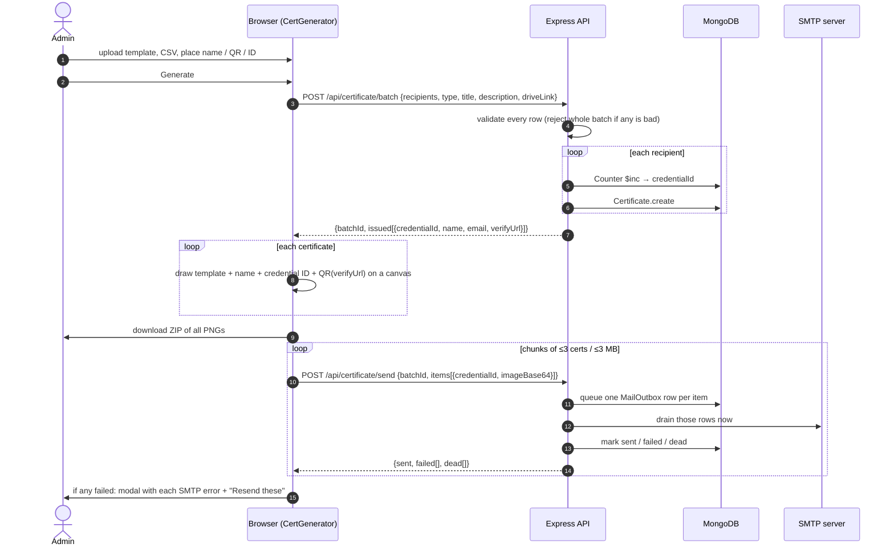

# 01 · SQAC Reference

How the certificate generator in the SQAC Portal works today, read directly
from its source. dBugLabs_OS ports this design, so every team should read this
once. Section [What is wrong with it](#what-is-wrong-with-it) lists the problems
we are not carrying over.

---

## Where the code lives

| Part | Location | State |
|---|---|---|
| Frontend (React 19 + Vite) | `SQAC_Portal/Frontend/src/Pages/admin/CertGenerator.jsx` (1,046 lines), `CertificateLogs.jsx` (527), `Pages/Verify.jsx` | Current. GitHub: `SQAC-Tech/SQAC_Portal` |
| Backend (Express 5 + Mongoose 9), current | `sqac-api-gateway/SQAC_Portal/Backend/src/`: `controllers/certificate.controller.js` (613), `lib/outbox.js` (295), `lib/mailer.js`, `lib/email-templates.js`, `models/Certificate.js`, `models/MailOutbox.js`, `models/Counter.js`, `routes/certificate.routes.js` | Current, but **local only**. The repo's remote, `SQAC-Tech/sqac-api-gateway`, returns *Repository not found*. |
| Backend, old | `SQAC_Portal/Backend/src/` | Stale. Still has the single-endpoint `upload-generated` flow that stored PNGs in Supabase. The current frontend does not call it. |

> Anyone who clones only `SQAC_Portal` gets a frontend that calls `/batch`,
> `/send` and `/batch/:id/resend`, and a backend that has none of them.

---

## The core idea: a certificate is a record, not a file

SQAC does not store certificate images. The PNG is drawn in the admin's
browser, downloaded in a ZIP, and attached to the email. The only durable copy
of a certificate is a document in MongoDB.

The QR code on the certificate encodes `<portal>/verify/<credentialId>`, and
that page renders the database record. This gives two properties that a stored
image cannot:

- **Verification is real.** An image only proves someone made a picture. The verify page answers "did the club actually issue this?" and can answer *no*.
- **Revocation is real.** There is no public image URL that stays alive forever. Flip a flag and the verify page says *revoked*.

The earlier SQAC design (still in the stale backend) uploaded every PNG to a
Supabase bucket and emailed the public URL. That design is gone because the
images could never be revoked, and the bucket grew forever.

---

## Credential IDs

Format: `SQAC-<TEAM>-<YY>-<NNNN>`, for example `SQAC-TECH-26-0042`.

| Part | Source |
|---|---|
| `SQAC` | Fixed prefix |
| `TEAM` | The `teamCode` from the CSV row, upper-cased, with anything that is not A–Z or 0–9 removed |
| `YY` | Last two digits of the current year |
| `NNNN` | Per-team, per-year sequence, zero-padded to 4 digits |

The sequence comes from a `Counter` document whose `_id` is
`CERT-<TEAM>-<YY>`. `nextSequence()` runs `findOneAndUpdate({ _id }, { $inc: { seq: 1 } }, { upsert: true })`,
which is atomic in MongoDB, so two admins generating at the same instant never
receive the same number. It is called once per recipient.

---

## The generation flow

Generation is split into phases because of one constraint: **the QR code
encodes the verify URL, and the verify URL contains the credential ID.** The
browser cannot draw a certificate until the server has handed out its ID.

Three rules come out of this order:

1. **IDs before rendering.** Explained above.
2. **ZIP before mail.** The ZIP is the deliverable. Mail is best-effort on top. A mail failure can never cost the admin the certificates.
3. **Chunked sends.** Vercel rejects any function request body over 4.5 MB, and base64 makes a PNG a third larger. The client sends at most 3 certificates or 3 MB of base64 per request. The server refuses more than 5 per request, because SMTP takes about a second per message and the function has a 60 s budget.

### What the frontend does

| Area | Behaviour |
|---|---|
| Template | Any image file, read with `FileReader` into an `Image`. Its natural size becomes the canvas size. |
| Recipients | CSV (parsed with PapaParse, `header: true`) or one manual entry. |
| CSV headers | Matched case-insensitively against aliases: name = `name`, `fullname`, `full_name`, `full name`; email = `email`, `mail`, `email address`, `email_address`; team = `teamcode`, `team_code`, `team code`, `team`. |
| CSV checks | Rows missing a name, email or team code are listed (row numbers as in the spreadsheet, so data row 1 is row 2) and Generate is disabled until fixed. |
| Details | Type (participation, completion, appreciation, custom), title, description, optional Drive folder link. |
| Name style | Font (Inter, Roboto, Arial, Times New Roman, Georgia, Courier New), size, bold, italic, colour. Drawn centred on its point. |
| Placement | Three modes (Name, QR, Credential ID). Clicking the preview moves the selected item. *Center X / Center Y* buttons. QR size slider 50–400 px; ID size slider 8–48 px; show/hide ID. |
| Preview | Re-drawn on every change. Uses "Sample Name" (or the manual name), a QR for `<portal>/verify/SAMPLE`, and a sample ID shaped like a real one so the admin can judge the space. |
| Portal URL | `VITE_PORTAL_URL`, falling back to `window.location.origin`. Configured explicitly because a printed QR is permanent; generating from a preview deployment would bake the preview host into every certificate. |
| Progress | Phases: reserving → rendering → mailing, with counts. |
| Failures | A modal listing each failed address, its credential ID and the raw SMTP error, with *Later* and *Resend these*. |
| Resend | Re-posts the images still held in memory through `/send` (which also refreshes the server's spooled copy). If the page was reloaded and the images are gone, it calls `/batch/:id/resend` to use the server's spool. |

### What the backend does

| Endpoint | Auth | Behaviour |
|---|---|---|
| `POST /api/certificate/batch` | `GENERATE_CERT` | Validates type, title, Drive link (must be http/https) and every row (name present, email matches a simple pattern, team code present). Any invalid row rejects the whole batch with `{ error, invalid: [{row, reason}] }` (first 20). Creates `BATCH-<ms>-<6 hex>`, then one counter `$inc` and one insert per row. |
| `POST /api/certificate/send` | `GENERATE_CERT` | Max 5 items. Looks up each certificate by `batchId` + `credentialId`, queues an outbox row with the rendered email and the image as an attachment, then drains exactly those rows. Sets `emailedAt` on the ones SMTP accepted. |
| `POST /api/certificate/batch/:batchId/resend` | `GENERATE_CERT` | Requeues `failed` and `dead` rows (optionally a list of IDs). Rows whose spooled image has expired are reported as `missingAttachment` and skipped. Sends the first 5 immediately; the cron takes the rest. |
| `PATCH /api/certificate/:credentialId/revoke` | `GENERATE_CERT` | Sets `revoked`, `revokedAt`, `revokedReason`, or clears them with `{ undo: true }`. No UI calls this yet. |
| `GET /api/certificate/batches` | `VIEW_CERT_LOGS` | Aggregates certificates by `batchId` (latest 30, max 100) with counts, plus outbox status counts per batch. |
| `GET /api/certificate/batch/:batchId` | `VIEW_CERT_LOGS` | Every certificate in the batch joined with its outbox row. Never returns the spooled image bytes. |
| `GET /api/certificate/verify/:credentialId` | public | The record, with the email masked (`ab•••@domain`). |
| `GET\|POST /api/certificate/outbox/drain` | `CRON_SECRET` (Bearer or `X-Cron-Secret`) | Sends up to 20 due rows across all batches. Returns how many are still due so a scheduler can call again. |
| `GET /api/certificate/my`, `GET /api/certificate/user/:userId` | session / `VIEW_CERT_LOGS` | A member's own certificates, or anyone's. Needs member accounts; not ported. |

The router is mounted before the app's global auth middleware, so every route
declares its own auth.

### The mail outbox

Every certificate email goes through a `MailOutbox` collection. Before it
existed, every `sendMail()` call was fire-and-forget with
`.catch(console.error)`, so a batch where half the mail failed looked
identical to one that fully succeeded.

| Rule | Detail |
|---|---|
| One row per recipient per batch | Unique index on `(batchId, refId)`. Queuing twice updates the row instead of double-sending. |
| Atomic claims | Each row is claimed with its own `findOneAndUpdate` that flips it to `sending` and increments `attempts`. When the browser and the cron race for a row, one wins. |
| Orphan reclaim | A row stuck in `sending` for 3 minutes belongs to a function that timed out. It becomes claimable again. |
| Error classification | SMTP 5xx and nodemailer `EENVELOPE`/`EMESSAGE` are **permanent** → `dead`. SMTP 4xx, network errors and anything unknown are **transient** → `failed`, retried. |
| Backoff | 1, 5, 15, 60, 180 minutes. Five attempts, then `dead`. |
| Spool | The image is stored on the row as base64 so a retry works after the tab is closed. Removed with `$unset` the moment SMTP accepts the mail. |
| TTL | `expiresAt` = created + 48 h, with a TTL index. Mongo deletes the whole row afterwards. A failure older than that must be regenerated. |
| No attachment, no mail | A certificate row whose image is gone is marked `dead` instead of sending a mail with a broken image. |
| Honest status | The UI says *Accepted*, never *Delivered*. SMTP has no delivery receipt. |

### The email

Subject: `SQAC Portal — Your Certificate: <title>`. The body has a header, the
recipient's name and the title, the credential ID and team as pills, the
certificate image inline (`cid:certificate`), a *Verify This Certificate*
button, an *Add to LinkedIn* button (LinkedIn's `profile/add?startTask=CERTIFICATION_NAME`
URL with the name, organisation, ID and verify URL filled in), an optional
*Open the Drive folder* button, and the verify URL as text.

The attachment is sent with `contentDisposition: "attachment"` as well as a
`cid`. Without that, Gmail shows the image inline but offers no paperclip, so
the recipient has no file to save.

The mail transport is a pooled nodemailer SMTP transport: 3 connections, 5
messages per second, 10 s connection and greeting timeouts, 20 s socket
timeout.

### The certificate log page

One expandable card per batch with *Accepted*, *Failed* and *Queued* counts.
Expanding a batch shows a table of recipients: name, email, team, credential
ID, mail status chip, number of attempts, the raw SMTP error, and how long is
left before the retry window closes. Actions: resend one row, resend all failed,
export failures as CSV.

### The verify page

Fetches `/verify/:credentialId` and shows the recipient's name, the title, the
type, the issue date, the issuer, the credential ID and the masked email, or
a *Verification Failed* message. A revoked certificate is shown as revoked
with its reason.

---

## What is wrong with it

Every item below is fixed in the dBugLabs_OS design. Most are worth fixing in
SQAC too.

| # | Problem | Impact | Where we fix it |
|---|---|---|---|
| 1 | The working backend exists only on one laptop; its GitHub repo is gone. The backend in `SQAC_Portal` is stale. | Losing that laptop loses the backend. A fresh clone does not work. | dBugLabs_OS is one repo, one app. |
| 2 | Names, titles and team codes from the CSV are put into the email HTML without escaping. | A CSV cell like `<a href=…>` becomes a live link in a mail sent from the club's address. | [07 Email](07-email-and-outbox.md#escaping) |
| 3 | `createBatch` writes certificates one by one. A failure on row 40 leaves rows 1–39 in the database, burns their numbers, and returns a 500. | Half-issued batches; gaps in the sequence. | [05 Data model](05-data-model.md#reserving-credential-ids) reserves the range in one `$inc` and inserts all records together, rolling back on failure. |
| 4 | The font picker offers Inter and Roboto, but nothing loads them for the canvas. | Names silently render in a fallback font. | [06 Generator UI](06-generator-ui.md#fonts) |
| 5 | The preview draws the QR inside an `onload` callback. | Quick changes can paint an old QR over a newer frame. | [06 Generator UI](06-generator-ui.md#the-preview) |
| 6 | A 300 dpi A4 template renders a PNG of several MB. One certificate over about 3.3 MB is over Vercel's 4.5 MB limit after base64. | That recipient can never be emailed. | [06 Generator UI](06-generator-ui.md#rendering-a-certificate) re-encodes the mail copy as JPEG when needed. |
| 7 | Credential IDs are sequential and the verify endpoint is public with no rate limit. | Anyone can walk `…-0001`, `…-0002`, … and list every recipient's name, event and masked email. | [08 Security](08-security.md#sec-03-credential-id-enumeration) |
| 8 | The revoke endpoint exists but no screen calls it. | Revocation needs a developer. | [06 Generator UI](06-generator-ui.md#certificate-log-admincertificateslogs) adds Revoke and Restore. |
| 9 | Route guards for `/user/:userId` and `/upload-generated` were commented out in the old backend. | Any signed-in member could read anyone's certificates or issue certificates. Fixed in the current backend; worth confirming nothing still serves the old one. | Not applicable (single admin). |

---

## What we reuse, and what we rewrite

| Piece | Decision |
|---|---|
| Four-phase flow (reserve → render → ZIP → mail) | Reuse as designed |
| Outbox rules (claims, reclaim, classification, backoff, spool, TTL) | Reuse as designed, ported to the native MongoDB driver |
| CSV aliases, row checks | Reuse, adding `code`/`event` aliases |
| Chunk sizes and limits | Reuse |
| Email layout | Rewrite in dBug branding, with escaping |
| Credential ID | `DBUG-` prefix; final format pending [SEC-03](08-security.md#sec-03-credential-id-enumeration) |
| Auth | Rewrite: one admin password instead of member roles |
| Fonts, preview, rendering | Rewrite to fix items 4–6 |
| Member pages (`/my`, `/user/:id`) | Drop |
