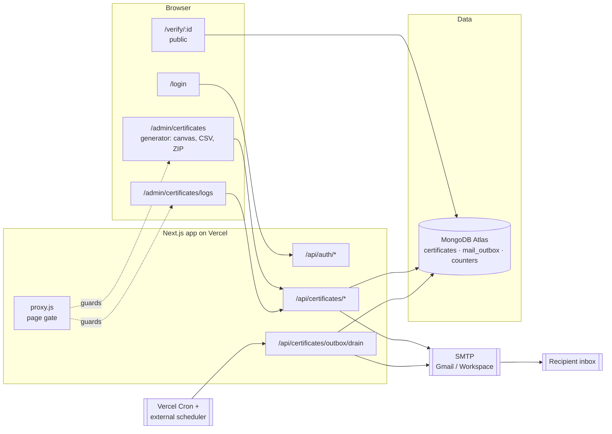
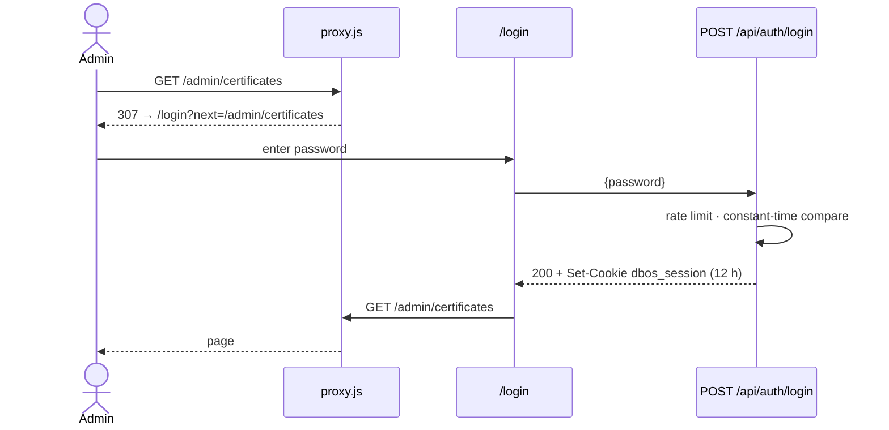
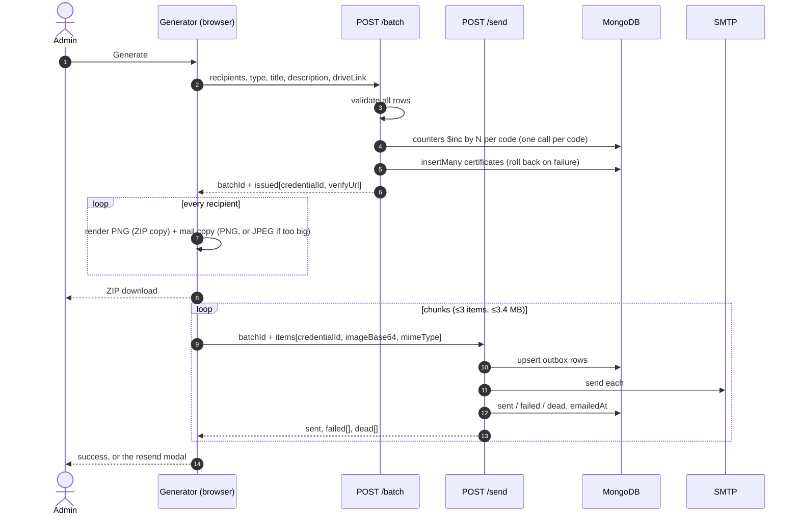
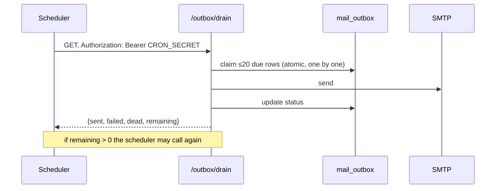

# 02 · Architecture

The whole system on one page, then the decisions behind it.

---

## The system



| Component | Responsibility |
|---|---|
| **Browser: generator** | Holds the template image and CSV, draws certificates on a `<canvas>`, builds the ZIP, and posts rendered images to the API in small chunks. All image work happens here. |
| **`proxy.js`** | Redirects signed-out visitors away from `/admin/*`. Not the only gate: every admin API route checks the session too. |
| **`/api/auth/*`** | Password check, session cookie, logout. |
| **`/api/certificates/*`** | Reserves credential IDs, writes records, queues and sends mail, serves the log, revokes, verifies. |
| **`/api/certificates/outbox/drain`** | Sends whatever mail is due. Called by a scheduler, never by a person. |
| **MongoDB** | The only durable state: certificate records, the mail outbox, and ID counters. |
| **SMTP** | Sends mail. Its answer (accepted, temporary failure, permanent failure) drives the outbox. |

There is no file storage. Templates and rendered certificates never touch the
server's disk or a bucket. The only image bytes the server ever holds are the
temporary spool in `mail_outbox`, deleted on success or after 48 hours.

---

## Stack

Matches `dbug-labs-recruitment`, so anyone who has worked on that repo can work
on this one.

| Layer | Choice | Why |
|---|---|---|
| Framework | Next.js 16 (App Router), React 19, JavaScript | Same as the recruitment site; one deployable for UI and API |
| Database | MongoDB Atlas, native `mongodb` driver (v7) | Same as recruitment; atomic `$inc` for IDs; TTL indexes for the spool |
| Mail | `nodemailer` over SMTP | Works with the club Gmail today; swappable later |
| CSV | `papaparse` | Handles quoted fields, BOMs and odd line endings |
| ZIP | `jszip` | Builds the ZIP in the browser |
| QR | `qrcode` | Draws straight onto a canvas |
| Styling | Plain CSS with variables (`app/globals.css`) | Same approach and palette as recruitment |
| Fonts | `next/font/google`: Anton, Oswald, Barlow (brand), Playfair Display, Great Vibes (certificate names) | Self-hosted, and actually loaded, which the canvas needs |
| Hosting | Vercel | Free tier is enough; see [10 Ops](10-deployment-and-ops.md) |

---

## Request flows

### Sign in



Detail: [03 Auth](03-auth.md)

### Issue a batch



Detail: [04 API](04-api.md), [06 Generator UI](06-generator-ui.md)

### Retry in the background



Detail: [07 Email and outbox](07-email-and-outbox.md)

### Verify

`GET /verify/<id>` is a server-rendered page that reads the certificate
straight from MongoDB and shows one of four states: valid, revoked, not found,
or unavailable (database error). There is also a JSON endpoint,
`GET /api/certificates/verify/<id>`, for anyone integrating.

---

## Folder layout

The code does not exist yet. This is the layout the Web teams should create,
so files land where the spec expects them.

```
dBugLabs_OS/
├─ app/
│  ├─ layout.jsx                 fonts, <html>, metadata (noindex)
│  ├─ globals.css                palette, components
│  ├─ page.jsx                   redirect → /admin/certificates
│  ├─ login/
│  │  ├─ page.jsx
│  │  └─ LoginForm.jsx           client
│  ├─ admin/
│  │  ├─ layout.jsx              server: session check, top bar
│  │  ├─ AdminNav.jsx            client: links, logout
│  │  ├─ page.jsx                redirect → /admin/certificates
│  │  └─ certificates/
│  │     ├─ page.jsx
│  │     ├─ CertGenerator.jsx    client: the generator
│  │     └─ logs/
│  │        ├─ page.jsx
│  │        └─ CertificateLogs.jsx
│  ├─ verify/[credentialId]/page.jsx   server-rendered, public
│  └─ api/
│     ├─ auth/login/route.js
│     ├─ auth/logout/route.js
│     └─ certificates/
│        ├─ batch/route.js                     POST
│        ├─ batch/[batchId]/route.js           GET
│        ├─ batch/[batchId]/resend/route.js    POST
│        ├─ batches/route.js                   GET
│        ├─ send/route.js                      POST
│        ├─ [credentialId]/revoke/route.js     PATCH
│        ├─ verify/[credentialId]/route.js     GET (public)
│        └─ outbox/drain/route.js              GET, POST (CRON_SECRET)
├─ lib/
│  ├─ db.js              lazy MongoClient singleton
│  ├─ session.js         sign / verify session token, password compare (Web Crypto)
│  ├─ auth.js            requireAdmin() for route handlers
│  ├─ ratelimit.js       in-process fixed window
│  ├─ certificates.js    validation, ID reservation, createBatch, public view
│  ├─ outbox.js          queue, claim, drain, requeue, summaries
│  ├─ mailer.js          pooled nodemailer transport
│  └─ email-template.js  certificate email HTML (escaped)
├─ proxy.js
├─ public/logo.png
├─ next.config.mjs       security headers, no-store on /api
├─ vercel.json           daily drain cron
├─ .env.example
└─ docs/                 this folder
```

Ownership: `lib/`, `app/api/`, `proxy.js` and config belong to
[Web backend](../teams/web-backend.md). Everything else under `app/` belongs to
[Web frontend](../teams/web-frontend.md). `app/globals.css` is shared and
changes to it are reviewed by both.

---

## Decisions

Each decision lists the alternatives we rejected, so nobody has to re-argue it.
To change one, follow *Changing the spec* in the [docs index](../README.md#changing-the-spec).

### Decision 1: a certificate is a record, not a file

**Chosen:** store only the record; render images in the browser; email them as
attachments; verify against the record.

**Rejected:** storing PNGs in Vercel Blob or Drive and emailing links. Costs
storage forever, cannot be revoked, and proves nothing on its own (anyone can
host a picture).

**Consequence:** if a recipient loses the email, the admin regenerates the
certificate (or shares the Drive folder link added to the batch). We accept
that.

### Decision 2: render in the browser

**Chosen:** the admin's browser draws every certificate.

**Rejected:** server-side rendering with `node-canvas` or Sharp. Native
dependencies on Vercel are fragile, fonts have to be bundled separately, and a
1,000-certificate batch would blow the function time limit.

**Consequence:** the admin's tab must stay open during rendering (seconds to a
couple of minutes). Mailing after that is safe to interrupt, because the outbox
and drain finish the job.

### Decision 3: one admin password

**Chosen:** a single shared password in an environment variable, with a
signed, stateless session cookie.

**Rejected:** accounts with roles (SQAC's model), or Google sign-in via
NextAuth (the recruitment site's model). Both are more to build and run, and
v1 has one kind of user: whoever is issuing certificates for the club.

**Consequence:** there is no per-person audit trail. Every certificate records
`issuedBy: "dBug Labs"`. Rotating the password signs everyone out. Revisit if
more than a handful of people need access.

### Decision 4: an outbox, not fire-and-forget mail

**Chosen:** every mail is a database row with a status, retries and a 48 h
spool.

**Rejected:** sending directly from the request and logging errors. SQAC did
that first, and a batch with half its mail failed looked the same as one that
fully succeeded.

### Decision 5: credential IDs from an atomic counter

**Chosen:** a per-code, per-year counter incremented with `$inc` by the batch
size, so a whole batch reserves its numbers in one atomic step.

**Rejected:** random UUIDs alone (unreadable on paper), or counting existing
documents (races between two admins).

**Open:** whether to add a random suffix to stop enumeration. See
[SEC-03](08-security.md#sec-03-credential-id-enumeration).

### Decision 6: Next.js, one deployable

**Chosen:** UI and API in one Next.js app.

**Rejected:** SQAC's split (Vite frontend + Express backend in separate repos).
That split is how SQAC ended up with a frontend whose backend lived on one
laptop.

---

## Limits that shape the design

| Limit | Value | Where it bites | How we stay under it |
|---|---|---|---|
| Vercel request body | 4.5 MB | Posting rendered images | ≤3 items and ≤3.4 MB of base64 per `/send`; mail copy re-encoded as JPEG above about 2.5 MB |
| Function duration | Keep every request under 60 s | Sending mail | ≤5 mails per `/send`, ≤20 per drain, at about 1 s each |
| SMTP rate | Gmail about 500 per day; Workspace about 2,000 per day | Large events | Pooled transport at ≤5 per second; split very large events across days |
| MongoDB document | 16 MB | Spooled image on an outbox row | Images are ≤3.4 MB of base64 |
| Atlas free tier | 512 MB storage | Spool during a big failed run | Spool deleted on success; TTL deletes the rest in 48 h |
| Batch size | 1,000 recipients | Browser memory and time | Enforced by the API |
