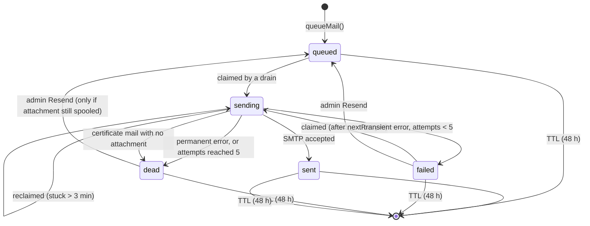

# 05 · Data Model

MongoDB Atlas, accessed with the native `mongodb` driver (v7). Three
collections. No other persistent state exists anywhere in the system.

| Collection | Holds | Grows by |
|---|---|---|
| `certificates` | One document per issued certificate. This **is** the certificate. | One per recipient, forever |
| `mail_outbox` | One document per certificate email, with its delivery state and a temporary image spool | One per recipient; each deleted 48 h after creation |
| `counters` | One document per code per year, holding the last credential number used | One per new code per year |

Database name comes from `MONGODB_DB` (e.g. `dbuglabs_os`). Production,
preview and local development each use a **different** database name so tests
never touch real certificates.

---

## `certificates`

### Example

```json
{
  "_id": { "$oid": "6701…" },
  "credentialId": "DBUG-WS-26-0007",
  "batchId": "BATCH-1791190046224-bb7e90",
  "code": "WS",
  "issuedToName": "Asha Rao",
  "issuedToEmail": "asha@example.com",
  "issuedBy": "dBug Labs",
  "type": "participation",
  "title": "Git & GitHub Workshop",
  "description": "Hands-on session, 4 October 2026",
  "driveLink": "https://drive.google.com/drive/folders/abc123",
  "issuedAt": { "$date": "2026-10-05T08:47:26.224Z" },
  "revoked": false,
  "revokedAt": null,
  "revokedReason": null,
  "emailedAt": { "$date": "2026-10-05T08:47:30.010Z" }
}
```

### Fields

| Field | Type | Required | Notes |
|---|---|---|---|
| `credentialId` | string | yes | Unique. Printed on the certificate and encoded in the QR. Never changes. |
| `batchId` | string | yes | Groups one press of *Generate* |
| `code` | string | yes | Normalised code (A–Z, 0–9, ≤12 chars) |
| `issuedToName` | string | yes | Exactly as typed in the CSV, trimmed. Escaped when shown, never altered. |
| `issuedToEmail` | string | yes | Lower-cased |
| `issuedBy` | string | yes | Always `"dBug Labs"` in v1 (no individual accounts) |
| `type` | string | yes | `participation`, `completion`, `appreciation` or `custom` |
| `title` | string | yes | Same for every certificate in the batch |
| `description` | string or null | no | Same for every certificate in the batch |
| `driveLink` | string or null | no | Same for every certificate in the batch. Stored per record so one read has everything the email needs. |
| `issuedAt` | date | yes | Same for every certificate in the batch |
| `revoked` | boolean | yes | Default `false` |
| `revokedAt` | date or null | yes | Set on revoke, cleared on restore |
| `revokedReason` | string or null | yes | Public. ≤300 chars. |
| `emailedAt` | date or null | yes | Set when SMTP first accepts this certificate's mail. `null` means never accepted. Survives the outbox row's expiry, so the log stays correct after 48 h. |

What is deliberately **not** stored: the rendered image, the template, the
layout, any user or session data.

### Indexes

| Index | Options | Serves |
|---|---|---|
| `{ credentialId: 1 }` | unique | Verify lookups; guarantees no duplicate IDs even if the counter logic has a bug |
| `{ batchId: 1, issuedAt: -1 }` | | Batch detail, resend, send lookups |
| `{ issuedAt: -1 }` | | The log's newest-first aggregation |

---

## `mail_outbox`

### Example

```json
{
  "_id": { "$oid": "6701…" },
  "batchId": "BATCH-1791190046224-bb7e90",
  "refId": "DBUG-WS-26-0007",
  "kind": "certificate",
  "to": "asha@example.com",
  "subject": "dBug Labs: your certificate for Git & GitHub Workshop",
  "html": "<div …>…</div>",
  "attachment": {
    "filename": "Asha_Rao_Certificate.png",
    "contentType": "image/png",
    "contentBase64": "iVBORw0KGgo…"
  },
  "status": "failed",
  "attempts": 2,
  "lastError": "421 4.7.0 Try again later",
  "lastAttemptAt": { "$date": "2026-10-05T08:52:31.000Z" },
  "sentAt": null,
  "nextRetryAt": { "$date": "2026-10-05T08:57:31.000Z" },
  "createdAt": { "$date": "2026-10-05T08:47:28.000Z" },
  "updatedAt": { "$date": "2026-10-05T08:47:28.000Z" },
  "expiresAt": { "$date": "2026-10-07T08:47:28.000Z" }
}
```

### Fields

| Field | Type | Notes |
|---|---|---|
| `batchId` | string | Same as the certificate's |
| `refId` | string | The credential ID. `(batchId, refId)` is unique. |
| `kind` | string | `"certificate"` in v1. Kept so other modules can reuse the outbox later. |
| `to`, `subject`, `html` | string | The fully rendered email, stored so a retry sends exactly the same thing |
| `attachment` | object or absent | The spool. `$unset` as soon as the mail is accepted. |
| `status` | string | See the state machine below |
| `attempts` | int | Incremented when a sender claims the row |
| `lastError` | string or null | Raw SMTP or network error, ≤500 chars. Shown to the admin. |
| `lastAttemptAt` | date or null | Set on every claim. Used to detect orphaned `sending` rows. |
| `sentAt` | date or null | When SMTP accepted it |
| `nextRetryAt` | date | Not claimable before this |
| `createdAt`, `updatedAt` | date | |
| `expiresAt` | date | `createdAt + 48 h`. Set once on insert, never pushed back. TTL deletes the row after this. |

### State machine



| Status | Meaning | Shown to the admin as |
|---|---|---|
| `queued` | Waiting for a sender | Queued |
| `sending` | A sender has it right now | Sending |
| `sent` | SMTP accepted it | Accepted |
| `failed` | Transient error; will retry at `nextRetryAt` | Retrying |
| `dead` | Permanent error, or 5 attempts used | Failed |

### Retry timing

| After attempt | Wait before next |
|---|---|
| 1 | 1 min |
| 2 | 5 min |
| 3 | 15 min |
| 4 | 60 min |
| 5 | — (becomes `dead`) |

A resend resets `attempts` to 0 and `nextRetryAt` to now.

### Indexes

| Index | Options | Serves |
|---|---|---|
| `{ batchId: 1, refId: 1 }` | unique | Idempotent queueing; per-batch lookups |
| `{ status: 1, nextRetryAt: 1 }` | | The drain's "what is due" query |
| `{ expiresAt: 1 }` | `expireAfterSeconds: 0` | Automatic deletion after 48 h |

MongoDB's TTL monitor runs about once a minute, so a row can outlive
`expiresAt` by a minute or two. Code must not assume the row is gone exactly
at `expiresAt`; it should check the attachment instead.

---

## `counters`

```json
{ "_id": "CERT-WS-26", "seq": 7 }
```

| Field | Notes |
|---|---|
| `_id` | `CERT-<code>-<YY>` |
| `seq` | The last number handed out for that code and year |

No indexes beyond `_id`.

### Reserving credential IDs

One batch reserves all its numbers for a code in **one** atomic operation:

```js
// n = how many recipients in this batch have this code
const doc = await counters.findOneAndUpdate(
  { _id: `CERT-${code}-${yy}` },
  { $inc: { seq: n } },
  { upsert: true, returnDocument: 'after' },
)
const first = doc.seq - n + 1     // this batch owns first … doc.seq
```

Then the batch builds every certificate document in memory, assigning numbers
in recipient order, and writes them with one `insertMany({ ordered: true })`.
If the insert fails, it runs `deleteMany({ batchId })` and returns `500`.

Properties this gives:

| Property | Why |
|---|---|
| Two admins can generate at once without collisions | `$inc` is atomic; each gets a disjoint range |
| A batch is all-or-nothing | One insert plus rollback |
| Invalid CSVs burn no numbers | Validation runs before any `$inc` |
| A failed insert may leave a gap | Accepted; gaps are harmless, duplicates are not |
| The year rolls over automatically | The key contains `YY`, so 1 January starts a new sequence per code |

Never compute the next number by counting or sorting existing certificates.
That races.

---

## Credential ID format

Current format: `DBUG-<CODE>-<YY>-<NNNN>`, e.g. `DBUG-WS-26-0007`.

- `NNNN` is zero-padded to 4 digits and grows past 9999 without breaking (`DBUG-WS-26-10000`).
- The format is still **pending** [SEC-03](08-security.md#sec-03-credential-id-enumeration), which may add a random suffix (e.g. `DBUG-WS-26-0007-K3F9`). Code everywhere except `lib/certificates.js` must treat the ID as an opaque string.

---

## Sizing

| Item | Size | At 1,000 certificates |
|---|---|---|
| `certificates` document | about 0.6 KB | about 0.6 MB, permanent |
| `mail_outbox` row after send | about 4 KB (HTML only) | about 4 MB, gone after 48 h |
| `mail_outbox` row while spooled | about 0.7–3.4 MB | only failed or in-flight rows; worst case if all 1,000 fail at 1.5 MB = 1.5 GB |

That worst case does not fit the Atlas free tier (512 MB). It would only happen
if SMTP is completely down for a whole large run. [10 Ops](10-deployment-and-ops.md#runbook-smtp-is-down)
says what to do: stop, fix SMTP, then resend while the spool is still there,
or regenerate after.

At 0.6 KB per certificate, the free tier holds hundreds of thousands of
certificates. Storage is not a concern for the records themselves.

---

## Backups

Atlas free tier has no automatic backups. Because `certificates` is the
proof that a certificate is real, losing it would make every printed QR code
fail verification.

- Web backend runs `mongodump` of the `certificates` and `counters` collections after every event batch and stores it in the club's Drive folder (task WEB-B-12).
- Never restore `counters` to an older value than the highest number in `certificates`, or IDs will be reissued and the unique index will reject the next batch.
